# Retcona

> "Recording Every Timeline Change: Oversight Network, Assistant" — 모든 타임라인 변화를 기록하다: 감독 네트워크, 보조자

웹소설 연재 중 쌓이는 캐릭터·장소·사건 설정을 자동으로 기록하고, 새 원고가 기존 기록과 모순되는지 자동으로 찾아주는 서비스입니다.

> 아래 내용은 이 프로젝트의 기획 및 설계서입니다. 1부는 무엇을, 왜 만드는지(기획)를, 2부는 그것을 어떻게 만드는지(설계)를 다룹니다.

---

## 1부 · 기획

### 1. 프로젝트 개요

| 항목 | 내용 |
|---|---|
| 프로젝트명 | Retcona |
| 프로젝트명 의미 | 원문: "Recording Every Timeline Change: Oversight Network, Assistant"<br>번역: "모든 타임라인 변화를 기록하다: 감독 네트워크, 보조자" |
| 유형 | 개인 프로젝트 / 웹 서비스 |
| 한 줄 소개 | 웹소설 연재 중 쌓이는 캐릭터·장소·사건 설정을 자동으로 기록하고, 새 원고가 기존 기록과 모순되는지 자동으로 찾아주는 서비스 |

### 2. 배경 및 문제 정의

웹소설 연재는 긴 기간에 걸쳐 화(episode) 단위로 이어 쓰는 구조다. 화수가 쌓일수록 작가가 초반에 정한 설정을 스스로 정확히 기억하고 추적하기가 점점 어려워진다.

실제로 자주 발생하는 문제 유형:
- **외형 불일치**: 초반에 정한 캐릭터의 눈 색깔, 흉터 위치 등이 후반부 묘사와 어긋남
- **행동 불일치(OOC)**: 캐릭터의 확립된 성격에 맞지 않는 행동이 서술됨
- **시공간 모순**: 이미 죽은 인물의 재등장, 나이·계절 계산 오류, 이동 거리상 불가능한 동선
- **장소 오류**: 장소 간 거리나 지리적 특징이 이전 서술과 어긋남

작가가 매 화를 쓸 때마다 전체 원고를 다시 읽어 검증하는 것은 화수가 늘어날수록 비효율이 기하급수적으로 커지는 작업이다.

### 3. 핵심 가치 제안

- 작가가 매번 전체 원고를 재검토하지 않아도, 새 화 원고를 입력하는 것만으로 설정 모순을 자동 탐지
- 고정 캐릭터 설정은 미리 입력해도 되고, 입력하지 않으면 원고에 처음 등장하는 순간 자동으로 생성된다 — 이렇게 확보된 설정과, 연재하며 누적되는 가변 기록(사건·위치·관계)을 함께 대조
- 오류를 자동으로 고쳐주는 것이 아니라, 근거 문장과 함께 "발견하여 제시"하는 데 집중 — 최종 판단은 작가가 내림
- 플래그를 확인하다 누락된 설정이 있었다는 걸 알게 되면, 전체를 다시 돌리지 않고 그 항목만 즉시 재검증할 수 있음

### 4. 타겟 사용자

- 장편·연재 웹소설을 집필 중인 개인 작가
- 특히 등장인물이 많고 세계관이 복잡한 장르(판타지, 로맨스판타지, 무협 등)의 작가
- 화수가 많이 쌓여 스스로 설정을 추적하기 어려워진 연재 작가

### 5. 페르소나

#### 페르소나 A — 설정파 작가
| 항목 | 내용 |
|---|---|
| 이름(가상) | 이서연, 27세 |
| 상태 | 로맨스판타지 웹소설 연재 중, 주 3회 연재, 현재 180화 진행 |
| 특징 | 세계관과 등장인물 설정이 방대함. 별도 노트/엑셀에 설정을 정리해왔지만 연재가 길어지며 업데이트가 누락되는 경우가 잦음 |
| Pain Point | 새 화를 쓸 때마다 "이 설정이 예전에 뭐였는지" 확인하려고 과거 화를 다시 검색해서 읽는 데 상당한 시간이 듦. 독자 댓글로 설정 오류를 지적받고 나서야 알아차리는 경우도 있음 |
| Goal | 연재 속도를 유지하면서도 설정 오류로 인한 독자 이탈을 막고 싶음 |

#### 페르소나 B — 즉흥파 작가
| 항목 | 내용 |
|---|---|
| 이름(가상) | 김태민, 24세 |
| 상태 | 첫 장편 연재를 시작한 신인 작가, 판타지 장르, 30화 진행 중 |
| 특징 | 세세한 설정을 미리 다 정하기보다 쓰면서 즉흥적으로 세계관을 확장하는 스타일 |
| Pain Point | 초반에 가볍게 정해둔 설정을 스스로도 기억 못 해서, 이미 쓴 내용과 모순되는 전개를 만들까봐 불안해함 |
| Goal | 최소한의 사전 설정만으로도 이후 집필에서 모순을 방지하고 싶음 |

두 페르소나는 각각 "사전 설정 대조"와 "누적 기록 대조"라는 서비스의 두 축과 대응된다 — 설정파는 미리 입력한 고정 설정을 기준으로, 즉흥파는 연재하며 누적된 기록을 기준으로 검증받는 쪽에 더 크게 의존하게 된다.

### 6. 핵심 기능

#### 6.1 계정 관리 · 마이페이지
이메일 또는 소셜 로그인(Google, Kakao, Naver)으로 가입하고, 실명 대신 필명(닉네임)을 정해 활동한다. 마이페이지에서 여러 작품을 한 계정으로 등록·관리하고, 작품별 인물 관계도·타임라인을 확인하며, 필요 시 회원 탈퇴까지 처리할 수 있다.

#### 6.2 서비스 내 집필 에디터
장문을 입력할 수 있는 에디터에서 원고를 직접 작성한다. 임시저장과 저장을 지원해 작업 중 내용이 유실되지 않으며, 저장된 원고를 기준으로 검증을 실행한다. 이미 저장한 화도 다시 열어 수정할 수 있다.

#### 6.3 세계관 · 캐릭터 사전 설정 (선택)
집필을 시작하기 전에 세계관(시대적 배경, 마법/무공 체계, 세력·조직, 역사)과 캐릭터(이름, 외형, 성격, 말투 등)를 미리 입력해둘 수 있다. 입력한 내용은 이후 모든 검증의 기준이 되며, 입력하지 않아도 원고를 쓰는 과정에서 자동으로 채워진다.

#### 6.4 캐릭터 설정 대조 (외형 / 행동)
캐릭터 설정 카드(고정 속성 + 가변 속성)는 사전 입력이 선택 사항이다. 입력해두면 그 기준으로, 입력하지 않았다면 원고에 새 인물이 등장할 때 자동 생성된 설정을 기준으로 외형·행동 묘사가 어긋나는지 탐지한다. 모순 없는 새로운 정보는 연재가 진행될수록 자동으로 설정에 쌓인다.

#### 6.5 사건 타임라인 대조
연재 순서(화 번호)와 극중 시간을 각각 기준으로, 캐릭터·장소의 상태 변화 이력과 새 원고 내용이 모순되는지 탐지한다.

#### 6.6 장소 설정 대조
장소의 지리적 특징, 다른 장소와의 거리·연결 관계를 기준으로 장소 묘사 오류나 이동 동선의 모순을 탐지한다.

#### 6.7 인물 관계도 · 스토리 타임라인 자동 생성
누적된 관계·상태 이력 데이터를 바탕으로, 캐릭터 간 인물 관계도와 화/극중 시간 기준 스토리 타임라인을 별도 작업 없이 그래프로 자동 생성해 보여준다. 스토리 타임라인은 단순 시간순 나열이 아니라, 캐릭터·장소에 따라 사건이 갈라지고 다시 합류하는 과정까지 표현한다.

#### 6.8 (부가) 캐릭터 일러스트 생성
입력해둔 캐릭터 설정을 바탕으로 일러스트를 생성하는 기능. 핵심 개연성 엔진과는 별도 모듈로, 우선순위상 후순위로 개발한다.

### 7. 차별점

단순히 설정을 메모·위키 형태로 정리해두는 기존 방식과 달리, 새 원고 입력 시 자동으로 기존 기록과 대조하여 모순 후보를 먼저 찾아 제시한다는 점이 핵심 차별점이다. 작가가 능동적으로 설정을 찾아보는 것이 아니라, 서비스가 능동적으로 문제를 제기하는 방향. 설정을 미리 다 채워두지 않아도 원고만으로 바로 시작할 수 있다는 점도 진입장벽을 낮춘다.

### 8. 기대 효과

- 개연성 오류로 인한 독자 이탈 감소
- 설정 관리 및 재검토에 드는 작가의 시간·인지적 부담 감소
- 장기 연재에서도 일관된 세계관·캐릭터 유지 가능

### 9. 향후 확장 방향

- 공동 집필(다인 협업) 환경 지원
- 장르별 특화 설정 스키마 (마법 체계, 무공 체계 등)
- 일러스트 생성의 캐릭터 일관성 고도화
- 온프레미스(로컬 설치형) 버전으로 확장 — 작가 개인 PC에 설치해, 원고를 외부 서버로 보내지 않고 로컬에서 사용할 수 있는 형태로 제공 가능성 검토

---

## 2부 · 설계

### 1. 시스템 개요

- **목적**: 새 화 원고 입력 시, 기존에 누적된 설정·기록과 자동으로 대조하여 개연성 오류 후보를 탐지한다.
- **세 가지 검증 관점**: 외형/행동 위반, 장소 오류, 시공간(타임라인) 모순
- **설계 원칙**: 모듈 경계는 데이터 타입(캐릭터/장소)이 아니라 **판단 관점** 기준으로 나누고, 데이터 조회는 공유 레이어에서 일괄 처리한다. 다수 사용자가 동시에 쓰는 서비스이므로 모든 데이터·AI 처리는 사용자(작품) 단위로 격리된다.

### 2. UX 설계

#### 2.1 화면 흐름

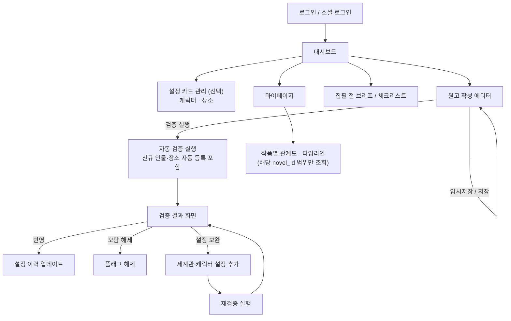

#### 2.2 원고 작성 에디터 화면

```
+--------------------------------------------------+
|  12화 작성                                        |
+--------------------------------------------------+
|                                                    |
|   (장문 입력 영역)                                  |
|                                                    |
|                                                    |
+--------------------------------------------------+
|  마지막 저장: 2분 전    [임시저장]  [저장]  [검증 실행]|
+--------------------------------------------------+
```

- **임시저장**: 입력이 멈춘 뒤 일정 시간(디바운스) 또는 일정 주기로 자동 실행. AI 파이프라인은 호출하지 않고 원고만 보존
- **저장**: 사용자가 직접 누르는 즉시 저장. 임시저장과 동일하게 AI 파이프라인은 실행하지 않음
- **검증 실행**: 저장된 원고를 10.2의 작업 큐에 등록해 파이프라인을 실행 — 저장(쓰기)과 검증(AI 처리)을 분리해, 입력할 때마다 불필요한 AI 호출이 발생하지 않도록 한다
- **기존 화 불러오기**: 마이페이지(2.6)의 작품에서 화를 선택해 열면, `draft`·`submitted` 상태와 무관하게 해당 화의 원문이 그대로 로드되어 같은 에디터에서 이어서 수정할 수 있다
- **이미 검증된 화를 수정한 경우**: `status`가 `submitted`인 화를 수정해 저장하면 `status`가 다시 `draft`로 전환된다. 기존 검증 결과(2.4)는 그대로 남아 있되 "원고가 수정되어 최신 상태가 아님" 배너가 표시되며, 재검증은 자동 실행되지 않고 작가가 직접 "검증 실행"을 눌러야 갱신된다 — 저장과 검증을 분리하는 원칙을 수정 시에도 동일하게 유지

#### 2.3 세계관 · 캐릭터 사전 설정 화면

```
+--------------------------------------------------+
|  세계관 설정                        [+ 항목 추가]   |
+--------------------------------------------------+
|  [마법 체계] 오드 마나 시스템                        |
|   마나는 체내에서 생성되며 하루 최대 3회까지만 사용 가능 |
+--------------------------------------------------+
|  [세력] 아스텔 왕국                                 |
|   대륙 동부를 지배하는 왕정 국가 ...                  |
+--------------------------------------------------+
```

```
+--------------------------------------------------+
|  캐릭터 설정 — 이서하                     [저장]     |
+--------------------------------------------------+
|  고정 속성                                         |
|   이름 · 나이 · 눈 색깔 · 머리색 · 신장 · 흉터 · 출신  |
+--------------------------------------------------+
|  가변 속성                                         |
|   헤어스타일 · 복장 · 부상/건강 상태 · 소지품          |
+--------------------------------------------------+
|  성격 · 말투                                       |
|   성격 키워드 · 말투 특징 · 목표/가치관               |
+--------------------------------------------------+
```

- 세계관은 카테고리(시대적 배경/마법·무공 체계/세력·조직/역사/기타 규칙) + 제목 + 자유 서술 형태로 입력
- 캐릭터는 고정 속성 / 가변 속성 / 성격·말투 세 구획으로 입력 — 성격·말투는 OOC(행동 불일치) 판단에 쓰임
- 모두 선택 입력이며, 비워두면 2.2 에디터로 작성한 원고에서 자동으로 채워짐(7.4 참고)

#### 2.4 핵심 화면 — 검증 결과 화면 레이아웃

```
+-------------------------+--------------------------+
|                         |  ⚠ 모순 후보 (3)           |
|      원고 본문           |  ① 외형 불일치              |
|   (모순 구간 하이라이트)  |     근거 → 3화 "파란 눈"    |
|                         |  ② 장소 오류                |
|                         |  ③ 타임라인 모순             |
+-------------------------+--------------------------+
```

원문과 플래그를 좌우로 배치해 근거 문장을 바로 대조할 수 있게 한다. 각 플래그에는 "반영" · "오탐 해제" 외에 "설정 보완 후 재검증" 액션이 있어, 세계관·캐릭터 설정을 추가로 입력하고 그 자리에서 다시 검증할 수 있다.

#### 2.5 설계 원칙

- 캐릭터·장소 설정 사전 입력은 선택 사항 — 입력하지 않은 인물/장소는 원고에 처음 등장할 때 자동 생성됨
- 모순 없는 새로운 정보는 자동으로 설정에 반영되지만, 기존 설정과 모순되는 정보는 자동 수정 없이 항상 "제시 + 작가 확인" 구조를 따름 (상세는 7.4 참고)
- 모순 플래그는 설정을 보완해 재검증하면 해소될 수 있음 — 전체 재검증이 아니라 해당 플래그만 다시 판단 (상세는 7.5 참고)
- 플래그는 신뢰도순 정렬, 근거 문장 클릭 시 원문 위치로 이동

#### 2.6 마이페이지 화면

```
+--------------------------------------------------+
|  마이페이지                                        |
+--------------------------------------------------+
|  계정 정보                                         |
|   필명: 밤그림자                          [변경]     |
|   이메일: writer@email.com   연결됨: Google         |
+--------------------------------------------------+
|  내 작품                               [+ 새 작품]  |
|   이계의 검사        42화   수정: 2일 전             |
|                     [열기] [관계도·타임라인] [삭제]  |
|   왕좌의 유산        12화   수정: 1주 전             |
|                     [열기] [관계도·타임라인] [삭제]  |
+--------------------------------------------------+
|  ⚠ 위험 영역                                        |
|                                     [회원 탈퇴]     |
+--------------------------------------------------+
```

- **필명 변경**: 계정 정보의 [변경] 클릭 시 인라인으로 수정 (상세 제약은 3.6 참고)
- **내 작품 관리**: 작품 목록에서 제목 변경, 열기(화 목록 → 기존 화 선택 시 2.2 에디터로 이동, 새 화도 여기서 시작), 삭제 가능
- **관계도·타임라인 보기**: 작품별로 8장에서 설계한 인물 관계도·스토리 타임라인 그래프를 확인하는 화면으로 이동 (아래 2.7 참고)
- **작품 삭제**: 확인 모달 후 소프트 삭제(30일 보관, 기간 내 복구 가능) → 기간 경과 시 배치 작업으로 해당 `novel_id`에 속한 모든 데이터를 영구 삭제 — 4.1의 멀티테넌시 구조 덕분에 `novel_id` 하나로 모든 하위 데이터가 연결돼 있어 삭제 범위가 명확함
- **회원 탈퇴**: 위험 영역으로 분리해 실수 클릭 방지, 상세 절차는 3.5 참고

#### 2.7 작품별 관계도 · 타임라인 화면

```
+--------------------------------------------------+
|  이계의 검사 — 관계도 · 타임라인   [관계도][타임라인] |
+--------------------------------------------------+
|                                                    |
|          (8.2/8.3의 그래프를 이 영역에 렌더링)         |
|                                                    |
+--------------------------------------------------+
```

- 마이페이지의 작품 목록에서만 진입 — 별도 URL로 직접 접근해도 요청자의 `user_id`가 그 작품의 소유자가 아니면 10.1의 DB 레벨 격리 원칙에 따라 조회되지 않음
- 상단 탭으로 인물 관계도(8.2)와 스토리 타임라인 그래프(8.3)를 전환 — 8.4에서 설계한 동일한 그래프 컴포넌트를 재사용하므로 화면은 하나, 데이터만 다르게 바인딩됨

### 3. 인증 및 계정

#### 3.1 로그인 방식

| 방식 | 제공자 | 비고 |
|---|---|---|
| 자체 로그인 | 이메일 + 비밀번호 | 비밀번호는 해시(bcrypt 등)로 저장. 가입 폼에 필명(닉네임) 입력란 포함 |
| 소셜 로그인 | Google, Kakao, Naver | OAuth 2.0, 최초 로그인 시 계정 자동 생성 + 필명 설정 화면으로 이동(3.2 참고) |

#### 3.2 소셜 로그인 흐름

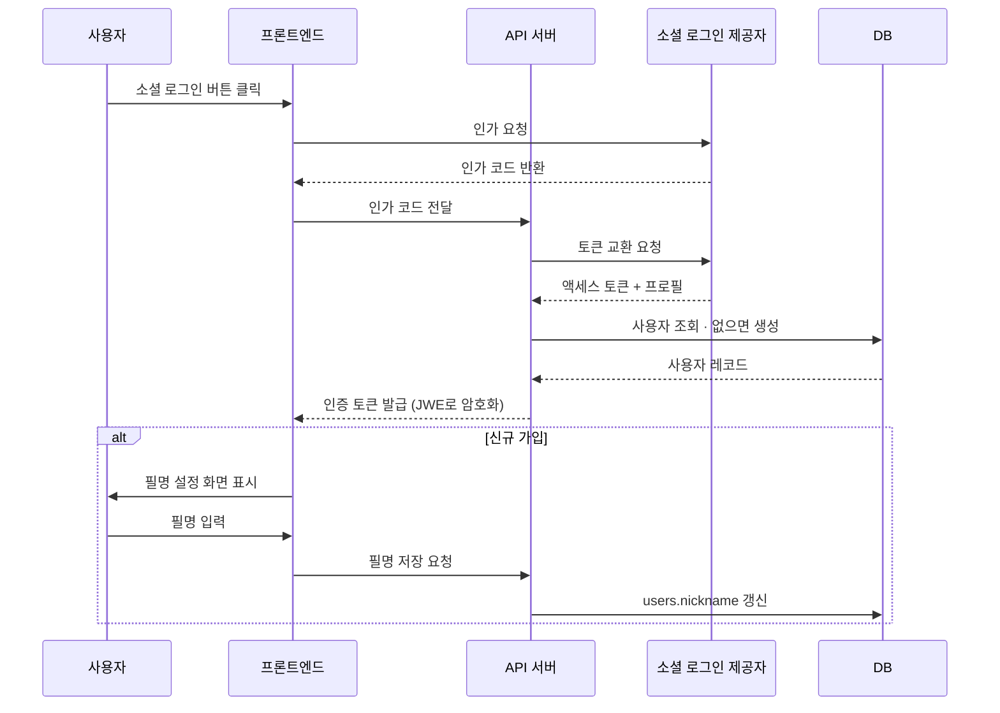

#### 3.3 토큰 암호화 (JWE)

발급하는 인증 토큰은 평문 JWT가 아니라 **JWE로 암호화**해 전달한다 — 사용자 ID, 작품 접근 권한 등 클레임이 토큰 자체에서 노출되지 않도록 한다.

- 구조(Nested JWT): 클레임을 JWT로 서명(JWS, 무결성 보장) → 서명된 토큰 전체를 JWE로 암호화(기밀성 보장)
- 알고리즘 예시: 서명 RS256 / 키 관리 RSA-OAEP-256 / 콘텐츠 암호화 A256GCM
- 서버만 복호화 키를 보유하며, 클라이언트는 암호화된 토큰만 저장·전달


#### 3.4 계정 구조

- 계정 하나로 여러 작품(소설)을 등록해 관리 가능
- 모든 데이터는 계정이 아니라 **작품 단위**로 격리 — 상세는 4장 데이터 모델 참고

#### 3.5 회원 탈퇴

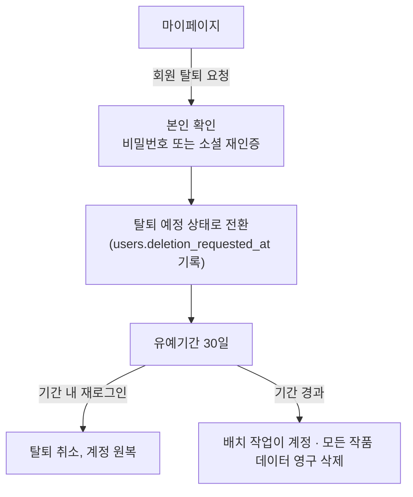

- **본인 확인**: 즉시 삭제하지 않고, 비밀번호 재입력(자체 로그인) 또는 소셜 재인증으로 본인 확인 후 탈퇴를 접수
- **유예기간**: 접수 즉시 삭제하지 않고 30일간 보류 — 그 사이 재로그인하면 탈퇴가 자동 취소됨(실수 탈퇴 방지)
- **삭제 범위**: 유예기간이 지나면 배치 작업(10.2의 큐/워커 인프라 재사용)이 해당 `user_id` 소유의 모든 `novels`와, 그 아래 `novel_id`로 연결된 모든 데이터(캐릭터·장소·화·클레임·플래그·사건 그래프 등)를 함께 삭제 — 4.1의 멀티테넌시 구조 덕분에 삭제 범위가 `user_id → novels → novel_id` 한 경로로 명확함
- **불가역성 고지**: 유예기간 경과 후에는 복구할 수 없다는 점을 탈퇴 접수 시점과 유예기간 중 명확히 안내

#### 3.6 필명(닉네임) 설정

- **최초 설정**: 자체 회원가입은 가입 폼에서, 소셜 로그인은 최초 로그인 시 별도 화면에서 필명을 입력받는다(3.2 참고) — 소셜 로그인은 프로필에서 이름을 가져오지 않고 항상 직접 입력받아, 실명 대신 필명을 쓰고 싶은 작가의 선택을 보장한다
- **변경**: 마이페이지(2.6)의 계정 정보 영역에서 언제든 변경 가능
- **제약**: 2~20자, 글자(모든 언어)·숫자·일반 공백만 사용 가능 — 이모지, 문장부호·특수 기호, 제로폭 문자 등은 불가. 중복은 허용 — 실제 식별자는 이메일/`user_id`이므로 필명 유일성을 강제할 필요는 없음

### 4. 데이터 모델

#### 4.1 멀티테넌시 구조

여러 사용자가 동시에 쓰는 서비스이므로, 한 사용자의 데이터가 다른 사용자에게 노출·혼입되지 않도록 **작품(novel) 단위로 데이터를 격리**한다.

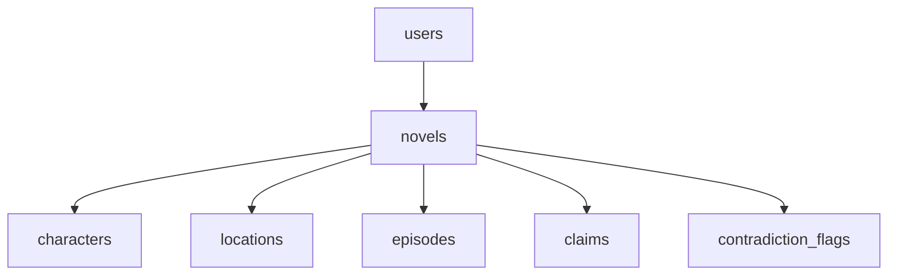

- **users**: 계정 정보 (id, email, `nickname` — 필명, provider, provider_id, password_hash, created_at, `deletion_requested_at` — 회원 탈퇴 접수 시각, 3.5 참고, `token_version` — 토큰에 담기는 `ver` 클레임과 일치해야 토큰이 유효하며, 탈퇴 접수 시 1 증가하고 탈퇴가 취소돼도 되돌리지 않음 — 접수 이전에 발급된 토큰을 영구히 폐기하기 위함)
- **novels**: 작품 정보 (id, user_id FK, title, created_at, `deleted_at` — 작품 소프트 삭제 시각, 2.6의 작품 삭제 기능에서 사용) — 한 계정이 여러 작품 소유 가능
- 아래 모든 엔티티 테이블은 `novel_id` FK를 가지며, 모든 조회·쓰기 쿼리는 반드시 `novel_id`로 필터링한다 (애플리케이션 레이어에서 강제)

#### 4.2 시간 축 이원화

연재 순서와 극중 시간은 다르며, 회상 화 등에서 둘이 어긋날 수 있으므로 반드시 분리 관리한다.

| 축 | 의미 | 용도 |
|---|---|---|
| `episode_index` | 연재 순서 (몇 화인가) | 작가가 지금까지 확정한 사실 누적 순서 — 외형/설정 모순 검사 기준 |
| `story_timestamp` | 극중 시간 (극중 며칠째인가) | 이동 거리·나이·계절 등 물리적 개연성 검사 기준 |

#### 4.3 테이블 구조

(아래 테이블은 모두 `novel_id` FK 보유)

- **characters**: 캐릭터 설정 카드. 고정 속성(이름·나이·눈 색깔·머리색·신장·흉터·출신)과 가변 속성(헤어스타일·복장·부상/건강 상태·소지품), 성격·말투(OOC 판단용)를 구분 저장. `source`(manual/auto_detected)로 작가 직접 입력인지 원고에서 자동 생성됐는지 구분
- **character_state_history**: `episode_index`, `story_timestamp` 기준 캐릭터 상태 변화 로그
- **locations**: 장소 설정 카드 (지리적 특징, 타 장소와의 거리·연결 관계). `source`(manual/auto_detected) 동일하게 보유
- **world_settings**: 세계관 설정 카드 (category: 시대적 배경/마법·무공 체계/세력·조직/역사/기타 규칙, title, content 자유 서술)
- **location_state_history**: 장소 상태 변화 로그
- **relations**: 인물 간 관계, 장소 간 거리/연결 정보
- **episodes**: 화별 원고 원문 + 임베딩. `status`(draft/submitted)로 작성 중/검증 요청 상태를 구분하고, 자동저장 시각(`updated_at`)을 기록. `submitted` 화를 수정하면 `status`가 다시 `draft`로 전환됨(2.2 참고)
- **claims**: 원고에서 추출한 검증 대상 주장 단위
- **contradiction_flags**: 오류 유형, 신뢰도, 근거 문장, `status`(open/resolved_by_revalidation/accepted/dismissed)
- **story_events**: 사건 노드 (id, episode_index, story_timestamp, title/요약) — 스토리 타임라인 그래프의 노드
- **event_participants**: 사건에 참여한 캐릭터 (event_id, character_id)
- **event_locations**: 사건이 일어난 장소 (event_id, location_id)
- **event_links**: 사건 간 연결 (from_event_id, to_event_id, link_type: 순차/분기/합류, branch_reason: 분기를 일으킨 캐릭터·장소)

#### 4.4 인덱스

- `(novel_id, entity_id, episode_index)` 복합 인덱스
- `(novel_id, entity_id, story_timestamp)` 복합 인덱스
- `(novel_id, from_event_id)`, `(novel_id, to_event_id)` 복합 인덱스 — 사건 그래프 순회용
- `novel_id`를 선두 컬럼으로 두어, 조회가 항상 해당 작품 범위로 좁혀지도록 한다

### 5. AI / 기술 스택

| 구성 요소 | 선택 | 비고 |
|---|---|---|
| 임베딩 | KURE-v1 + BM25 하이브리드 | 의미 기반 검색과 키워드 매칭을 함께 사용 |
| Cross-encoder 리랭커 | bge-reranker-v2-m3-ko 계열 | 관련 과거 설정 문장 Top-K 추출용 |
| NLI | klue-roberta + KorNLI 기반 | 소설 서술체/대사체 도메인으로 재파인튜닝 필요 |
| LLM (외부 API) | 모델 미정 | OOC 행동 판단, 애매한 모순 최종 검증, 클레임 추출 |
| DB | PostgreSQL + pgvector | 벡터 검색과 정형 데이터를 단일 DB로 관리 |

### 6. 코드 구조

#### 6.1 아키텍처

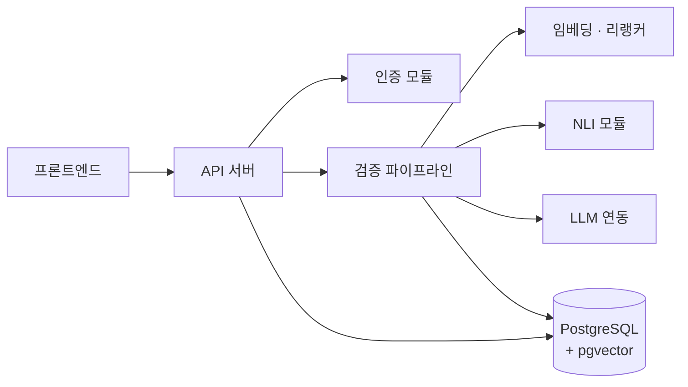

#### 6.2 폴더 구조

```
retcona/
├── frontend/          # 로그인, 설정 카드, 업로드, 검증 결과 화면
├── backend/
│   ├── api/            # REST 엔드포인트
│   ├── auth/             # 로그인 · 소셜 로그인(OAuth) · 토큰 발급
│   ├── pipeline/           # extract_claims, context_bundle, 판단 모듈 3종, merge
│   ├── models/              # DB 모델 (users, novels, characters, locations ...)
│   ├── ai/                   # 임베딩 · 리랭커 · NLI · LLM 클라이언트 래퍼
│   ├── workers/                # cpu_worker / gpu_worker 진입점 (WORKER_TYPE으로 분기)
│   └── infra/                    # QueueClient · StorageClient 등 클라우드 추상화 계층
└── db/                              # 마이그레이션 · 스키마
```

- `pipeline/` 내 3개 판단 모듈은 동일 인터페이스(`claims + context_bundle` 입력 → `flags` 출력)를 공유해 병렬 실행과 모듈 교체가 용이함
- 모든 `models/`, `pipeline/` 함수는 `novel_id`를 필수 인자로 받도록 설계해, 격리 누락을 코드 레벨에서 차단
- `pipeline/`과 `ai/`는 비즈니스 로직만 담고, 큐·스토리지 접근은 항상 `infra/`의 인터페이스를 거침 — 10.4 참고

### 7. 파이프라인 설계

#### 7.1 처리 흐름

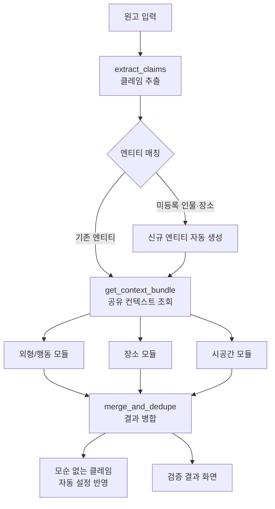

#### 7.2 모듈별 설계

| 모듈 | 주요 입력 필드 | 판단 방식 |
|---|---|---|
| 외형/행동 위반 | `fixed_attrs`, `latest_mutable_state`, `personality`, `world_settings` | 외형: NLI / 행동(OOC): LLM + 성격·말투 프로파일과 세계관 규칙 기반 추론 |
| 장소 오류 | `fixed_attrs`(지형), `relations`(거리) | NLI + 규칙 기반 거리 계산 |
| 시공간 모순 | `last_known_position`, `state_history`, `relations` | 규칙 기반 시간·거리 검증 + LLM 보조 |

#### 7.3 병렬화 시 고려사항

- 컨텍스트 사일로 방지: 세 모듈이 공유 번들을 통해 필요한 정보에 모두 접근
- 결과 병합 필수: 동일 원인 오류의 중복 탐지 제거
- 자원 경합 관리: 외부 LLM API 레이트 리밋, 로컬 모델은 배치 서빙(vLLM 등) 검토

#### 7.4 신규 엔티티 자동 등록 및 설정 자동 반영

- **엔티티 매칭**: 클레임의 인물·장소명을 기존 `characters`/`locations`와 이름·별칭 기준으로 매칭 (문자열 매칭 + 임베딩 유사도로 별칭 처리)
- **신규 등록**: 매칭되는 엔티티가 없으면 `source: auto_detected`로 새 레코드를 자동 생성하고, 첫 언급 내용을 초기 고정 속성으로 저장 — 작가가 사전에 입력하지 않은 인물·장소도 원고만으로 설정 카드가 만들어짐
- **자동 반영**: 모순으로 플래그되지 않은 클레임은 `character_state_history`/`location_state_history`에 자동으로 누적되어, 연재가 진행될수록 설정 카드가 스스로 채워짐
- 모순으로 플래그된 클레임만 2.5의 원칙대로 작가 확인 후 반영 — 자동 반영은 "새로운 정보 추가"에 한정되고, "기존 설정 수정"은 항상 작가 확인을 거침

#### 7.5 설정 보완 후 재검증

작가가 플래그를 보고 "사실 이건 세계관 규칙 때문에 맞는 서술"이라고 판단할 수도 있다 — 이 경우 누락됐던 설정을 추가하고 그 플래그만 다시 검증한다.

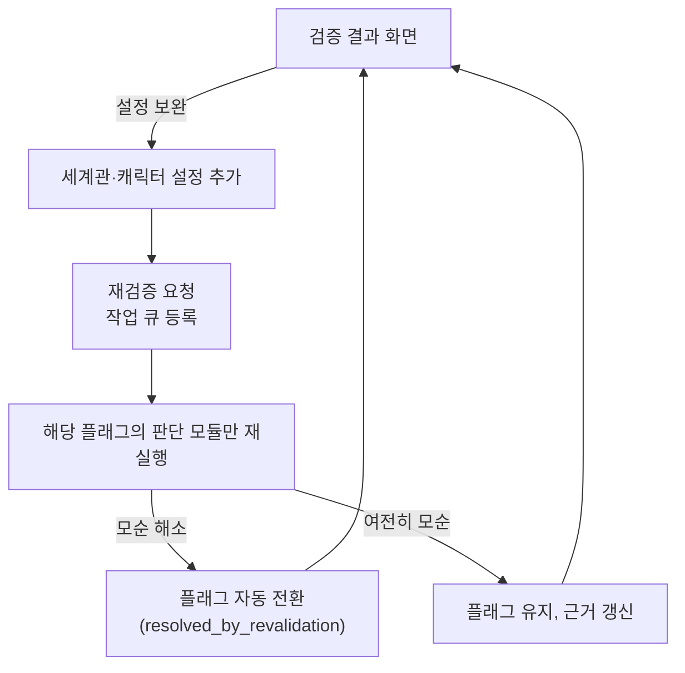

- 전체 파이프라인을 다시 돌리지 않고, 플래그를 발생시킨 판단 모듈만 새 컨텍스트 번들로 재실행 — 비용 절감
- 재검증도 10.2의 작업 큐를 거쳐 비동기로 처리
- 재검증으로 해소된 플래그는 근거(어떤 설정이 추가되어 해소됐는지)를 함께 남겨, 이후 같은 유형의 오탐을 줄이는 데 참고할 수 있게 한다

### 8. 인물 관계도 · 스토리 타임라인 시각화

#### 8.1 데이터 소스

- **인물 관계도**: `relations` 테이블을 조회해 그래프로 렌더링. 관계의 유형·방향성을 명시하기 위해 `relation_type`(가족/연인/원수 등), `direction` 컬럼 보강
- **스토리 타임라인 그래프**: `story_events` + `event_participants` + `event_locations` + `event_links`를 조회해 그래프로 렌더링. 사건을 노드로, 사건 간 연결을 엣지로 사용해야 분기·합류를 표현할 수 있으므로, 캐릭터·장소별 상태 로그만으로는 부족하고 사건 단위 테이블이 별도로 필요하다.
- `event_links`는 작가가 직접 다음 사건을 지정하거나, extract_claims 단계에서 사건 클레임(참여 캐릭터·장소·화)을 추출해 연결을 제안하는 반자동 방식으로 생성한다 — 이 역시 "제시 + 작가 확인" 원칙을 따른다.

#### 8.2 인물 관계도

캐릭터를 노드로, `relations`를 엣지로 하는 관계 그래프. 엣지 라벨 = 관계 유형, 방향성 있는 관계는 화살표로 표시.

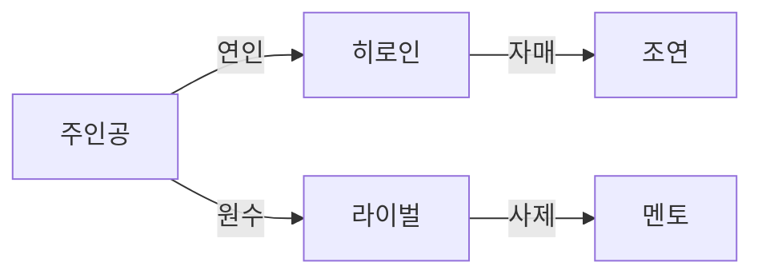

#### 8.3 스토리 타임라인 그래프

`story_events`를 노드로, `event_links`를 엣지로 하는 그래프. 한 사건에 참여한 캐릭터·장소가 이후 갈라지면 분기, 서로 다른 사건이 같은 사건으로 이어지면 합류로 표현된다.

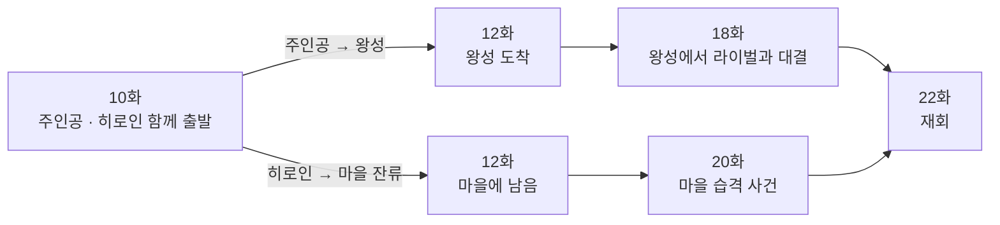

위 예시에서 10화 사건은 "주인공은 왕성으로, 히로인은 마을에 남는" 캐릭터·장소 기준 분기이며, 18화·20화의 서로 다른 사건 흐름은 22화 재회에서 합류한다.

#### 8.4 구현 방식

- 관계도·타임라인 모두 노드/엣지 구조이므로 프론트엔드에서 동일한 force-graph / D3.js 계열 그래프 컴포넌트를 재사용해 렌더링
- 화면 진입 시 서버가 해당 `novel_id` 범위의 관계·사건·연결 데이터를 조회해 그래프용 노드/엣지 JSON으로 반환
- 진입 경로는 2.7의 마이페이지 작품별 화면 — 별도 대시보드 메뉴가 아니라 "내 작품" 목록에서 작품을 고른 다음 보는 것으로 통일

### 9. 추가 모듈: 캐릭터 일러스트 생성

- 핵심 개연성 엔진과 분리된 독립 모듈
- 캐릭터 설정 카드의 고정 외형 속성 → 프롬프트 변환 → text-to-image API 호출
- 핵심 과제: 생성마다 동일 캐릭터로 인식되는 시각적 일관성 확보 (참조 이미지 기반 생성, 캐릭터 LoRA 학습 등 검토 필요)
- 개발 우선순위는 후순위

### 10. 동시성 및 멀티테넌시 처리

여러 사용자가 동시에 서비스를 쓸 때 데이터가 섞이거나 처리가 지연되지 않도록 DB와 AI 파이프라인을 다음과 같이 설계한다.

#### 10.1 DB 레벨 격리

- 모든 조회·쓰기는 `novel_id` 필터를 강제 (리포지토리 함수가 `novel_id`를 필수 인자로 받도록 설계)
- 방어적 이중 장치로 PostgreSQL **Row-Level Security(RLS)** 적용 검토 — 세션에 `novel_id`를 설정하고 정책으로 강제해, 애플리케이션 코드 실수로 인한 격리 누락도 DB 단에서 차단
- pgvector 유사도 검색도 반드시 `novel_id` 조건과 함께 수행 — 필터 없이 검색하면 다른 사용자의 설정 문장이 결과에 섞여 들어올 위험이 있음

#### 10.2 동시 요청 처리 — 작업 큐

검증 요청은 즉시 처리하지 않고 비동기 작업으로 큐에 등록한다.

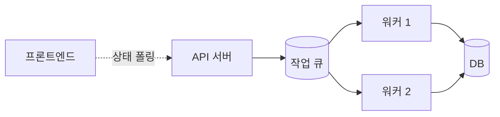

- 새 화 검증 요청 → 큐 등록 → 워커가 병렬 처리 → 결과 DB 저장 → 클라이언트는 폴링/웹소켓으로 완료 확인
- 원고 작성 에디터(2.2)의 "검증 실행" 버튼이 이 큐에 작업을 등록하는 진입점이다
- 사용자가 몰려도 API 응답은 즉시 반환되므로 서비스 지연 없이 안정적으로 동작

#### 10.3 AI 자원 경합 관리

- 로컬 모델(NLI, 리랭커): 배치 서빙 프레임워크(vLLM 등)로 여러 사용자의 요청을 묶어 처리해 자원 효율 확보
- 외부 LLM API: 동시 호출 수 제한(세마포어) + 레이트리밋 초과 시 재시도 백오프
- DB 커넥션: 커넥션 풀링(PgBouncer 등)으로 동시 사용자 증가 시 커넥션 고갈 방지

#### 10.4 GCP 배포 전제 워커 확장 설계

GCP 배포를 전제로, 워커를 안전하게 늘리고 줄일 수 있도록 코드와 인프라를 함께 설계한다.

##### 10.4.1 워커 종류 분리

| 워커 유형 | 역할 | 특성 | 확장 방식 |
|---|---|---|---|
| CPU 워커 | 클레임 추출 오케스트레이션, 규칙 기반 검증, LLM API 호출 | 네트워크 대기 위주, 가볍게 늘릴수록 처리량 비례 증가 | 큐 길이 기반 수평 오토스케일링 |
| GPU 워커 | 임베딩, 리랭커, NLI 추론 | 배치로 묶어야 효율이 나옴, 개수만 늘려도 소용없음 | 배치 서빙(vLLM) + 제한적 확장 |

##### 10.4.2 GCP 서비스 매핑

| 구성 요소 | GCP 서비스 |
|---|---|
| 작업 큐 | Pub/Sub |
| CPU 워커 실행 | Cloud Run |
| GPU 워커 실행 | Compute Engine GPU + MIG (또는 Cloud Run GPU) |
| DB | Cloud SQL for PostgreSQL (+pgvector) |
| DB 커넥션 관리 | Cloud SQL Auth Proxy + PgBouncer |
| 오브젝트 스토리지 | Cloud Storage |

##### 10.4.3 코드 설계 — 인터페이스 추상화

로컬 개발 환경 ↔ GCP 환경 전환과, 10.5의 단계적 백엔드 전환(CPU↔GPU, 외부 API↔자체 호스팅)을 코드 변경 없이 지원하기 위해 큐·스토리지·추론·LLM 접근을 인터페이스 뒤로 감춘다.

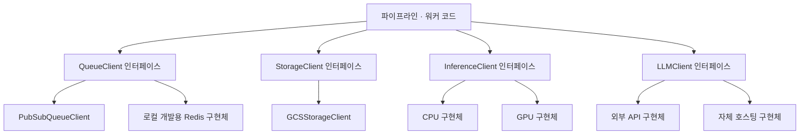

- `QueueClient`는 `enqueue(job)` / `dequeue()` / `ack(job_id)` 세 메서드만 노출 — 비즈니스 로직은 이 인터페이스만 사용하고 구현체를 알지 못함. 운영 환경은 `PubSubQueueClient`, 로컬 개발은 Redis 기반 구현체 사용
- `StorageClient`는 `GCSStorageClient`로 일러스트 이미지 등을 저장
- `InferenceClient`(NLI·리랭커)와 `LLMClient`도 같은 패턴 — 각각 `INFERENCE_BACKEND=cpu|gpu`, `LLM_PROVIDER=external|self_hosted` 환경변수로 구현체를 고른다. 7장의 판단 모듈은 이 인터페이스만 호출하고 실제 백엔드가 무엇인지 알지 못하므로, 10.5의 단계적 전환이 비즈니스 로직 변경 없이 설정값 변경만으로 가능해진다

##### 10.4.4 워커 코드 요구사항

- **무상태(stateless)**: 워커는 job payload와 DB 조회만으로 작업을 완결하며, 로컬 디스크·메모리에 상태를 남기지 않는다 — 오토스케일링으로 인스턴스가 아무 때나 뜨고 꺼져도 무관해야 함
- **멱등성(idempotency)**: 모든 job에 고유 ID를 부여하고 처리 완료 여부를 DB에 기록 — 큐의 at-least-once 전달로 같은 job이 중복 실행돼도 결과가 달라지지 않게 함
- **Graceful shutdown**: SIGTERM 수신 시 처리 중인 job을 마치거나 큐에 반환(ack deadline)한 뒤 종료 — scale-in 시 작업 유실 방지
- **역할 분기**: 하나의 이미지에서 환경변수 `WORKER_TYPE=cpu|gpu`로 진입점만 분리해, 배포 시 인스턴스 유형에 맞게 동일 코드를 재사용

##### 10.4.5 오토스케일링 트리거

- CPU/LLM 워커: 큐 대기 메시지 수 기반 — Cloud Run이 동시성 기준으로 자동 확장
- GPU 워커: 큐 깊이 + GPU 사용률 복합 지표로 판단하고, 콜드스타트 비용이 크므로 최소 인스턴스(warm pool) 유지를 고려

#### 10.5 비용 최소화 구성과 단계적 전환

개인 프로젝트 초기에는 상시 켜져 있는 리소스를 최대한 없애고, 쓴 만큼만 내는 조합으로 시작한다.

##### 10.5.1 비용 최소화 구성 (GCP 기준)

| 구성요소 | 초기 선택 | 비고 |
|---|---|---|
| LLM | 외부 API | 자체 호스팅 GPU 상시비용 회피 |
| NLI · 리랭커 | CPU 기반 Cloud Run | 정확도는 다소 낮지만 GPU 비용 없음 |
| CPU 워커 | Cloud Run, `min-instances=0` | 요청 없으면 0원 |
| 작업 큐 | Pub/Sub | 무료 한도 내 사용 |
| 프론트엔드 · 스토리지 | Cloud Storage | 무료 한도 내 사용 |
| 일러스트 생성 | 후순위로 제외 | 로드맵상 선택 단계와 동일 |

##### 10.5.2 DB는 예외 — 상시 비용이 발생하는 유일한 지점

Cloud SQL은 트래픽이 없어도 최소 사양 기준 상시 비용이 청구된다. 초기엔 GCP의 상시 무료 e2-micro VM에 PostgreSQL + pgvector를 직접 설치해 대체할 수 있다 — 단, 저사양이라 트래픽이 늘면 Cloud SQL로 옮겨야 한다.

##### 10.5.3 단계적 전환 흐름

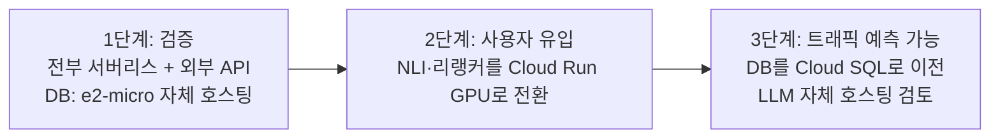

##### 10.5.4 전환이 코드 변경 없이 되도록 하는 설계

- **백엔드 선택은 전부 설정값**: `INFERENCE_BACKEND`, `LLM_PROVIDER`, `QUEUE_PROVIDER` 등 10.4.3의 인터페이스가 읽는 환경변수만 바꾸면 1→2→3단계 전환이 끝난다. 판단 모듈(7.2)이나 파이프라인 코드는 어떤 백엔드가 붙어있는지 알 필요가 없다
- **DB 접속도 설정값 하나(`DATABASE_URL`)로 통일**: 코드는 항상 로컬 소켓/포트로만 접속하고, 그 뒤에 e2-micro의 PostgreSQL이 붙어있는지 Cloud SQL Auth Proxy가 붙어있는지는 인프라 레이어의 문제로 분리한다 — DB를 옮겨도 애플리케이션 코드는 커넥션 문자열 하나만 바뀐다
- **오토스케일링 파라미터는 코드가 아니라 배포 설정(IaC)**: `min-instances`, 워커 개수 같은 값은 Terraform 등 배포 설정 파일에 두고, 트래픽이 늘 때 그 값만 올린다 — 애플리케이션 코드를 다시 배포할 필요가 없다
- **DB 마이그레이션 절차를 미리 정해둠**: e2-micro → Cloud SQL 전환 시 표준 `pg_dump`/`pg_restore`(또는 논리적 복제)로 이전하고, 스키마 마이그레이션 도구(예: Alembic)를 처음부터 사용해 두 환경에서 동일하게 재현 가능하게 한다
- **같은 인터페이스에 대해 두 구현체 모두 테스트**: `InferenceClient`·`LLMClient`의 cpu/gpu, external/self_hosted 구현체 각각에 대해 동일한 테스트를 돌려, 전환 시점에 처음 검증하는 일이 없게 한다

### 11. MVP 로드맵

| 단계 | 내용 |
|---|---|
| 1단계 | 로그인/소셜 로그인 + 마이페이지(작품 관리·회원 탈퇴) + 원고 작성 에디터(임시저장/저장) + 화 단위 엔티티 추출, 멀티테넌시 반영한 설정 카드 스키마 설계 |
| 2단계 | 외형 불일치 + 장소 모순 탐지 (NLI 기반) |
| 3단계 | 설정 보완 후 재검증 (플래그 단위 재판단) |
| 4단계 | 사건 타임라인 대조 (상태 이력 누적 로직) |
| 5단계 | OOC 행동 탐지 (LLM 기반) |
| 6단계 | 동시성 처리 (작업 큐, RLS 등) 정식 도입 + 클라우드 배포·워커 오토스케일링 |
| 7단계 | 인물 관계도 · 스토리 타임라인 시각화 |
| 8단계 (선택) | 캐릭터 일러스트 생성 |

---

## 로드맵

GitHub에서는 아래 각 단계를 Milestone으로 만들고, 세부 작업을 Issue로 쪼개 해당 Milestone에 연결하는 방식을 권장합니다.

- [ ] **1단계** — 로그인/소셜 로그인 + 마이페이지(작품 관리·회원 탈퇴) + 원고 작성 에디터(임시저장/저장) + 화 단위 엔티티 추출, 멀티테넌시 반영한 설정 카드 스키마 설계
- [ ] **2단계** — 외형 불일치 + 장소 모순 탐지 (NLI 기반)
- [ ] **3단계** — 설정 보완 후 재검증 (플래그 단위 재판단)
- [ ] **4단계** — 사건 타임라인 대조 (상태 이력 누적 로직)
- [ ] **5단계** — OOC 행동 탐지 (LLM 기반)
- [ ] **6단계** — 동시성 처리 (작업 큐, RLS 등) 정식 도입 + 클라우드 배포·워커 오토스케일링
- [ ] **7단계** — 인물 관계도 · 스토리 타임라인 시각화
- [ ] **8단계 (선택)** — 캐릭터 일러스트 생성

각 단계의 상세 내용은 위 [2부 · 설계 11. MVP 로드맵](#11-mvp-로드맵) 및 관련 섹션을 참고하세요.

## 라이선스

아직 라이선스가 지정되지 않았습니다. 공개 여부와 라이선스 종류를 정하면 `LICENSE` 파일을 추가하세요.
